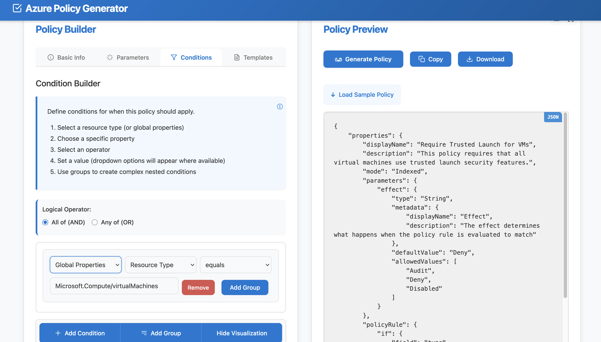

# Azure Policy Generator

A visual tool for creating and managing Azure Policies with an intuitive interface, eliminating the need to write complex JSON.

## Features

- **Visual Policy Builder** – Create policies with an intuitive UI instead of JSON
- **Advanced Condition Builder** – Create nested conditions with logical operators
- **Resource Coverage** – Support for all Azure resource types and properties
- **Policy Templates** – Pre-built templates for common scenarios
- **Policy Effects** – Support for all Azure Policy effects (Audit, Deny, etc.)
- **Export Options** – Copy to clipboard or download as JSON

## Setup & Usage

### Quick Start
1. Clone: `git clone https://github.com/siddharthtanna7/AzPolicyGenerator.git`
2. Open `index.html` in any browser

### Key Components
- **Policy Builder**: Main UI for policy creation
- **Condition Builder**: Visual editor for nested conditions
- **Parameter Builder**: Interface for policy parameters
- **Template Selector**: Pre-built policy templates
- **Utilities**: JSON generation and validation

### Data Files
- `resourceTypes.json`: Azure resource types and properties
- `policyEffects.json`: Policy effects with descriptions
- `policyTemplates.json`: Pre-defined templates by category
- `regions.json`: Azure regions list

## Contributing

Contributions welcome! Fork the repo, make changes, and submit a PR.

## TBD
- Initiative Builder for policy sets
- ARM/Bicep/Terraform export formats
- Direct Azure deployment integration
- Adding more resources and properties (via Azure Resource Manager API)
- Improving visualization for complex conditions

## Authors

- **Siddharth Tanna**
- **Anwar Ayoob**

## Note

We are actively in the process of adding support for all Azure resource types and their properties. Please feel free to contribute new resource definitions or suggest better approaches for resource management through pull requests or issues.

